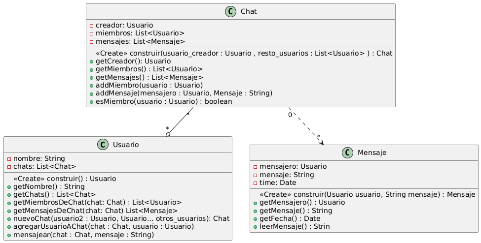

# Paradigmas
No cree una clase para la App, porque estoy asumiendo que los usuarios justamente se esten creando en la APP. 

Un usuario puede tener 0 o * chats y un chat puede tener como miembros 0 o * usuarios.

Al cada Chat ser privado, las personas las cuales no pertenecen al chat unicamente podran saber quien creo el chat y sus miembros. Mientras tanto solo los usuario que pertenecen a dicho chat podran ver los mensajes y añadir miembros. Si bien esto puede romper el principio de diseño de Tell, don't ask, crei que seria lo apropiado para mantener la consigna de que los chats son privados.

Los datos de los mensajes pueden ser accedido por cualquiera, al los usuarios poder hacer lo que quieran con los mensajes de cada chat

Codigo:
@startuml

class Usuario{
<<Create>> construir() : Usuario
-nombre: String
-chats: List<Chat>
+ getNombre() : String
+ getChats() : List<Chat>
+ getMiembrosDeChat(chat: Chat) : List<Usuario>
+ getMensajesDeChat(chat: Chat) List<Mensaje>
+ nuevoChat(usuario2 : Usuario, Usuario... otros_usuarios): Chat
+ agregarUsuarioAChat(chat : Chat, usuario : Usuario)
+ mensajear(chat : Chat, mensaje : String)
}

class Chat{
<<Create>> construir(usuario_creador : Usuario , resto_usuarios : List<Usuario> ) : Chat
- creador: Usuario
- miembros: List<Usuario>
- mensajes: List<Mensaje>
+ getCreador(): Usuario
+ getMiembros() : List<Usuario>
+ getMensajes() : List<Mensaje>
+ addMiembro(usuario : Usuario)
+ addMensaje(mensajero : Usuario, Mensaje : String)
+ esMiembro(usuario : Usuario) : boolean
}

class Mensaje{
<<Create>> construir(Usuario usuario, String mensaje) : Mensaje
- mensajero: Usuario
- mensaje: String
- time: Date
+ getMensajero() : Usuario
+ getMensaje() : String
+ getFecha() : Date
+ leerMensaje() : Strin
}

Chat "*" --o "*" Usuario
Chat "0" ..> "*"Mensaje

@enduml